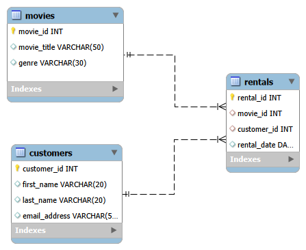

## Movie Rental Analysis - SQL Project.

Movie Rental Analysis is a beginner friendly sql project and
this project analyzes movie rental data to show customer behaviors, identify popular movies,
and provide data-driven business recommendations. Using real-world SQL techniques,
I answered key main questions about rental frequency, customer engagement, and genre performance.

## Database Structure

The analysis uses three tables:
```
customers
(customer_id (PRIMARY KEY), first_name, last_name, email_address)
movies
(movie_id (PRIMARY KEY), movie_title, genre)
rentals 
(rental_id (PRIMARY KEY), customer_id (FOREIGN KEY), movie_id (FOREIGN KEY), rental_date)
```




ER Diagram

## Dataset

All movie titles and customer information are sample data created randomly 

## SQL Skills Demonstrated
```bash
JOIN operations (INNER JOIN, LEFT JOIN)
Aggregations: COUNT(), MIN()
GROUP BY analysis
Filtering with WHERE and HAVING
Date functions (CURDATE(), INTERVAL)
Sorting (ORDER BY) and limiting (LIMIT)
String manipulation using CONCAT()
```


## Business Questions Answered
``` bash
What are the top 5 most rented movies?
How many rentals does each customer have?
Which movies were rented in the last year?
Which customers never rented anything?
What are the total rentals per genre?
When was each movie first rented?
```

## SQL Queries usde for analytics
```
-- Top 5 Most Rented Movies
SELECT m.movie_title,
       COUNT(*) AS times_rented
FROM rentals AS r
JOIN movies AS m
     ON r.movie_id = m.movie_id
GROUP BY m.movie_title
ORDER BY times_rented DESC
LIMIT 5;
```

```
-- Rentals Per Customer

SELECT CONCAT(c.first_name, ' ', c.last_name) AS customer_name,
       COUNT(*) AS times_rented
FROM rentals AS r
JOIN customers AS c
     ON r.customer_id = c.customer_id
GROUP BY c.customer_id
ORDER BY times_rented DESC;
```

```
-- Movies Rented in Last Year

SELECT m.movie_title,
       r.rental_date
FROM rentals AS r
JOIN movies AS m
     ON r.movie_id = m.movie_id
WHERE r.rental_date >= CURDATE() - INTERVAL 365 DAY;
```

```
-- Customers Who Never Rented

SELECT CONCAT(c.first_name, ' ', c.last_name) AS customer_name
FROM customers AS c
LEFT JOIN rentals AS r ON c.customer_id = r.customer_id
WHERE r.rental_id IS NULL;
```

```
-- Total Rentals Per Genre

SELECT m.genre,
       COUNT(*) AS times_rented
FROM rentals AS r
JOIN movies AS m
     ON r.movie_id = m.movie_id
GROUP BY m.genre
ORDER BY times_rented DESC;
```

```
--  First Rental Date for Each Movie

SELECT m.movie_title,
       MIN(r.rental_date)
       AS first_rented_date
FROM rentals AS r
JOIN movies AS m
     ON r.movie_id = m.movie_id
GROUP BY m.movie_title
ORDER BY first_rented_date ASC;
```

## Key Findings

Certain movies consistently outperform others, showing strong customer preferences.

Some customers have significantly higher rental counts - differences in engagement.

Crime/Drama genres had the highest rental frequency.


